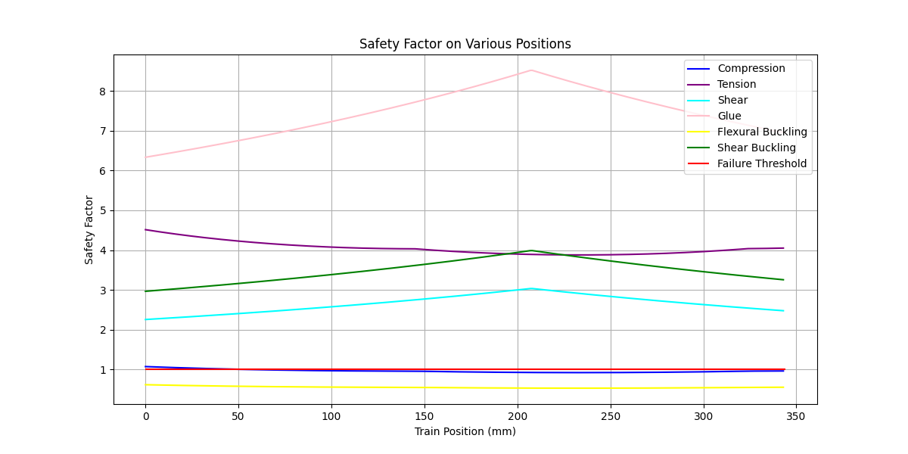
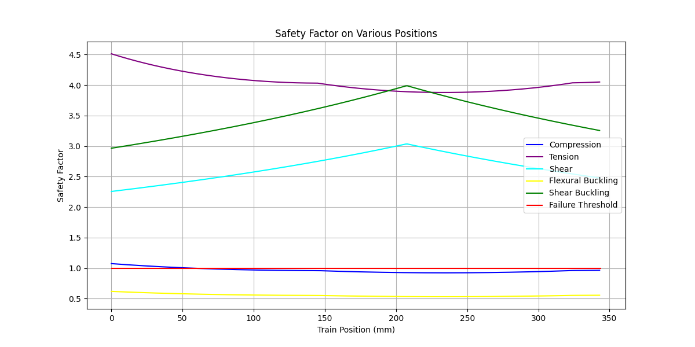
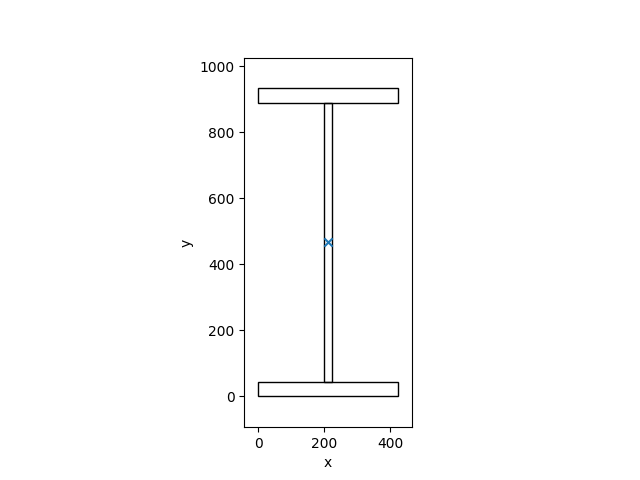

# CIV102-Bridge-Project

:tada: A 2D Matboard visualization of our final bridge, designed using opticutter.com, can be found
[here](https://ibb.co/YK2s9t2).

## Project Description

The CIV102 course has a term project where we build a bridge with a matboard that aims to survive under various load
cases. It is actually one of the requirements that we need to implement some sort of automated analysis procedure. Our
team decide to take this one step further and make these features possible:

- Composition of complex cross-sections using basic shapes
- Automatic calculation of (x̄, ȳ) (the centroid), I (the moment of inertia), and Q(y) (the first moment of area about
  a given axis)
- Automatic calculation of shear forces (pivot points) and expanded shear forces
- Shear force diagram
- Automatic calculation of bending moments (pivot points) and expanded bending moments
- Bending moment diagram
- Automatic calculation of axial and shear stresses
- Safe factor diagram
- Simulation of the train passing the bridge
- Finding the maximum load
- Optimization of the cross-section dimensions
- Extendability to other types of bridges
- **Extremely easy to use**

## Overview

We did a pretty good job designing the bridge. Our predicted load was 1400 Newtons using a quadratic variation in the
height of the cross-section. We can approximate the parabolic area by trapezoids.

Before actually making the bridge, we bought 3 matboards with the identical shape from
[Michaels](https://canada.michaels.com). We did a box beam and a trapezoid as two prototypes. If you try it on your own,
you will soon realize that the biggest limitation of the project is not designing, but your paper-cutting and gluing
skills. The trapezoid wastes a small amount of board area, resulting in fewer diaphragms. Also, the cutting optimization
App we use, [optiCutter](https://www.opticutter.com/), only supports rectangular panels. It is so hard to manufacture
that we decided to stick with the box beam, which still has a predicted maximum load of 1200 Newtons.

## Installation

```shell
pip install git+https://github.com/ATATC/CIV102-Bridge-Project.git
```

## Quick Start

This tutorial only covers beam bridges. If you are building a truss bridge, please read the raw codes.

All dimensions are measured in millimeters. All loads are measured in Newtons. All angles are measured in radians. All
complex units are combinations of these fundamental units.

### Deliverable 1 as an Example

It is quite obvious that you need to have a bridge before analyzing it. To create a `BeamBridge`, you need to know the
following parameters. The checked ones are defaulted to what we are given this year as the base case in load case 2.

- [ ] Total train load in Newtons
- [ ] Cross-section profile
- [x] Length of the bridge (1200mm)
- [x] Wheel positions ([172 348 512 688 852 1028], which is the center)
- [x] Load distribution (1.35 1.35 1 1 1 1)

The following case uses the default cross-section.

```python
from bridger import *

cross_section = CIV102Beam()
material = Material()
bridge = BeamBridge(452, cross_section)
bridge.plot_sfd(save_as="assets/images/sfd.png")
bridge.plot_bmd(save_as="assets/images/bmd.png")
print(f"(x_bar, y_bar): {cross_section.centroid()} mm")
print(f"I_x: {cross_section.moment_of_inertia()} mm4")
print(f"Ultimate applied stress: {bridge.ultimate_stress()} MPa")
print(f"FOS: {bridge.safety_factor((material.compressive_strength, material.tensile_strength))}")
```

You will see output like this:

<table>
<tr>
<td></td>
<td></td>
</tr>
</table>

```text
(x_bar, y_bar): (49.99999999999999, 41.43109435192319) mm
I_x: 418352.20899942354 mm4
Ultimate applied stress: (6.384059301633374, 7.592045684386937) MPa
FOS: (0.9398408937813106, 3.9515041462006852)
```

### Evaluation

#### Safety Factors

Once we have the bridge, we can now evaluate its performance. To do this, we need to use the `Evaluator` class.
Currently, it only supports evaluating with a uniform material. In the example below, we use the default material, which
is the matboard.

The coordinate system we use is coherent with the sign convention above, where the position of the train is the position
of the first wheel.

We can plot the safety factors against train positions.

```python
from bridger import *

cross_section = CIV102Beam()
bridge = BeamBridge(452, cross_section)
evaluator = Evaluator(bridge, Material())
evaluator.plot_safety_factors(save_as="assets/images/safety_factors.png")
```



Notice that the factor of safety of glue is way to high so all other curves are squeezed together. We can set
the color of glue to `None` to remove it from the plot.

```python
from bridger import *

cross_section = CIV102Beam()
bridge = BeamBridge(452, cross_section)
evaluator = Evaluator(bridge, Material())
evaluator.plot_safety_factors(
    colors=("blue", "purple", "cyan", None, "yellow", "green"), 
    save_as="assets/images/safety_factors_no_glue.png"
)
```



#### Dead Zones

```python
from bridger import *

cross_section = CIV102Beam()
bridge = BeamBridge(452, cross_section)
evaluator = Evaluator(bridge, Material())
safety_factors = evaluator.pass_the_train()
```

`Evaluator.pass_the_train()` returns six lists of safety factors. Each list corresponds to the safety factors when the
train is at different positions. We can then calculate the dead zones, also known as the intervals where any type of
safety factor is less than the threshold (1 by default, 0.6 in this case).

```python
from bridger import *

cross_section = CIV102Beam()
bridge = BeamBridge(452, cross_section)
evaluator = Evaluator(bridge, Material(), safety_factor_threshold=.6)
safety_factors = evaluator.pass_the_train()
dead_zones = evaluator.dead_zones(*safety_factors)
print(dead_zones)  # [(20, 343)]
```

The dead zones are tuples of two integers representing the start and end positions of each interval. `[(20, 343)]` means
that when the first wheel of the train is at any position between 20 and 343 millimeters from the start, the bridge will
fail.

#### Maximum Load

To determine the maximum load under given conditions, we can use the `Evaluator.maximum_load()` method.

```python
from bridger import *

cross_section = CIV102Beam()
bridge = BeamBridge(452, cross_section)
evaluator = Evaluator(bridge, Material())
max_load, cause = evaluator.maximum_load()
print(f"The maximum load is {max_load} N, limited by {cause}")
```

It returns a float number representing the maximum load and a string representing the reason.

```text
The maximum load is 240.0889550207032 N, limited by flexural buckling
```

### Centroid of a Cross-section

```python
from bridger import *

cross_section = CIV102Beam()
print(cross_section.centroid())  # (49.99999999999999, 41.43109435192319)
```

### First Moment of Area

```python
from bridger import *

cross_section = CIV102Beam()
print(cross_section.q(cross_section.centroid()[1]))  # 6193.283330576374
print(cross_section.q_max())  # 6193.283330576374
```

### Complex Cross-sections

To construct a cross-section consisting of multiple basic cross-sections, you need to know the x and y offsets of each
component. We use the common sign convention that the origin of each relative coordinate system is in the bottom-left
corner.

#### Hollow Square HSS 305x305x13

A hollow square can be divided into four nonoverlapping rectangles.

```python
from bridger import *

cross_section = ComplexCrossSection([
    (RectangularCrossSection(305, 12.7), 0, 0), 
    (RectangularCrossSection(12.7, 279.6), 0, 12.7),
    (RectangularCrossSection(12.7, 279.6), 292.3, 12.7),
    (RectangularCrossSection(305, 12.7), 0, 292.3)
])
print(cross_section.moment_of_inertia() * 1e-6)  # 211.84488605453336
```

In fact, we provide a shortcut for hollow rectangular cross-sections.

```python
from bridger import *

cross_section = HollowBeam(305, 305, 12.7)
print(cross_section.moment_of_inertia() * 1e-6)  # 211.84488605453336
```

#### I-beam W920x446

```python
from bridger import *

cross_section = ComplexCrossSection([
    (RectangularCrossSection(423, 43), 0, 0),
    (RectangularCrossSection(24, 847), 199.5, 43),
    (RectangularCrossSection(423, 43), 0, 890)
])
print(cross_section.moment_of_inertia() * 1e-6)  # 8424.6495395
```

This gives you I-beam W920x446, which is equivalent to:

```python
from bridger import *

cross_section = IBeam(933, 423, 43, 24)
print(cross_section.moment_of_inertia() * 1e-6)  # 8424.6495395
```

#### Visualization

```python
from bridger import *

cross_section = IBeam(933, 423, 43, 24)
cross_section.visualize()
```



## Optimization

All design choices in this project are Convex Optimization Problems (COPs). By default, we use advanced
(multi-resolution) grid search to solve them. We also provide an option to use differential evolution from SciPy. 

There is a much better way to implement the whole framework, that is to calculate everything in tensors using PyTorch.
However, since it takes a lot of time to come up with a differentiable algorithm to find the cross-section properties,
we choose to stick with the current discrete approach. If you are gifted, you can rewrite the whole thing in PyTorch
instead of NumPy so that you can use gradient-based optimization to replace the current search-based approach.

### Cross-section Optimization

The following example is optimizing the cross-section dimensions when the width of the matboard is 813, so that the
surface lengths of the cross-section must add up to 813 and the top must be wider than the bottom. There are some
other constraints applied to the range of the parameters, such as the height must be a multiple of 20. See details in
the project handout.

```python
from bridger import *

MATBOARD_WIDTH: float = 400


def constraint(kwargs: dict[str, float]) -> dict[str, float] | None:
    top, bottom, height = kwargs["top"], kwargs["bottom"], kwargs["height"]
    kwargs["thickness"] = 1.27
    kwargs["outreach"] = 5
    used = bottom + 2 * (height - 2.54) + 10
    return kwargs if used <= MATBOARD_WIDTH and top > bottom else None


matboard_width = 813
cross_section = CIV102Beam()
bridge = BeamBridge(452, cross_section)
evaluator = Evaluator(bridge, Material())
optimizer = BeamOptimizer(evaluator)
params, load = optimizer.optimize_cross_section({
    "top": (100, MATBOARD_WIDTH, .1),
    "bottom": (10, MATBOARD_WIDTH, .1),
    "height": (20, 200, 20),
}, constraint=constraint)
print(params, load)
```

It takes about 20 seconds to finish searching, thanks to the help of LRU cache.

```text
{'top': 100.19999999999999, 'bottom': 60.69999999999999, 'height': 120.0, 'thickness': 1.27, 'outreach': 5} 719.6692696587126
```

## Varying Cross-sections

The codebase inherently supports varying cross-sections. You can pass the cross-section as a function of position into
`VaryingBeamBridge`. The following bridge has a side view as a trapezoid.

```python
from bridger import *

material = Material()
params = {'top': 100.2, 'bottom': 60.7, 'thickness': 1.27, 'outreach': 28}
max_height = 180
min_height = 120
margin = 60


def cross_section(x: float) -> CrossSection:
    if x <= margin or x >= 1250 - margin:
        return CIV102Beam(**params, height=min_height)
    return CIV102Beam(**params, height=max_height - ((max_height - min_height) / (625 + 1.5 * margin)) * abs(
        x - 625 - 1.5 * margin))


bridge = VaryingBeamBridge(452, cross_section)
evaluator = Evaluator(bridge, material)
print(evaluator.maximum_load())  # (402.24314942828937, 'shear buckling')
```

## Team 602

### Authors

Sorting follows alphabetic order of the first name initials and does not reflect contributions. The hyperlinks refer to
portfolios.

D. Chan, J. Zhou, N. Saxena, and [T. Fu](https://atatc.github.io)

### Citation

```bibtex
@techreport{team602civ102,
    title = {CIV102 Bridge Project Design Report},
    author = {Chan, D. and Zhou, J. and Saxena, N. and Fu, T.},
    institution = {Faculty of Applied Science and Engineering, University of Toronto},
    year = {2025},
    month = {November},
    type = {Course Project Report},
    course = {CIV102: Structures and Materials},
    note = {Team 602}
}
```
