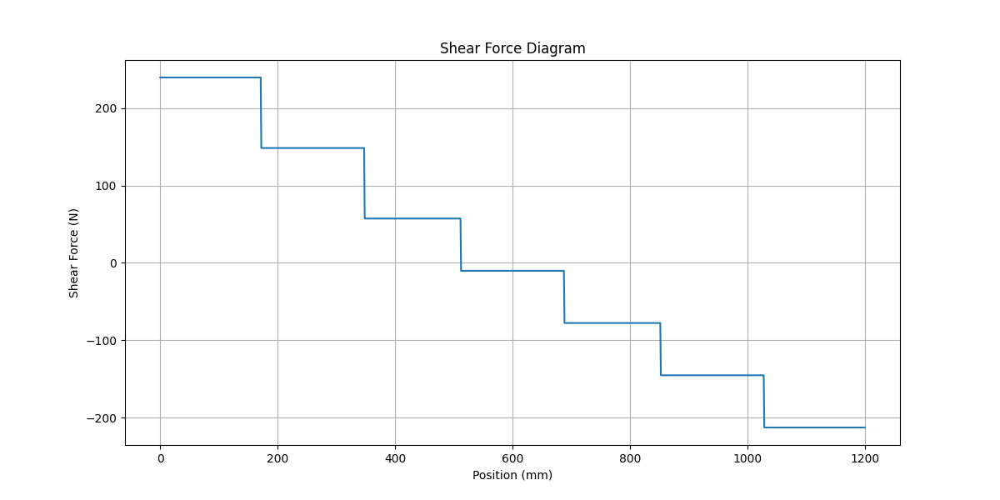
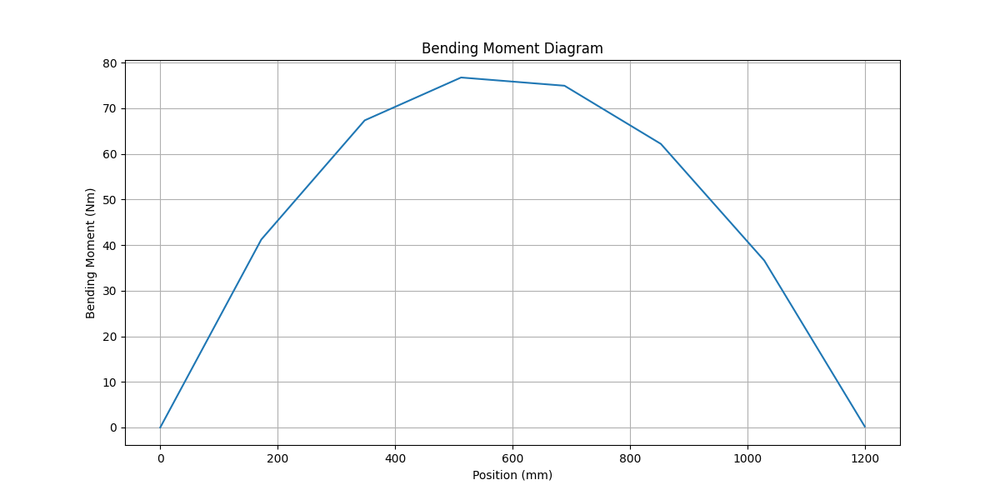
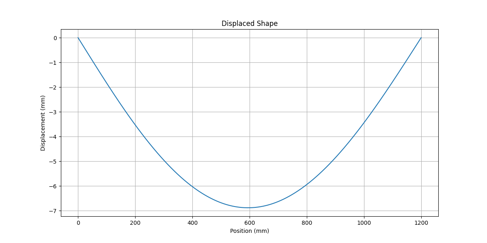
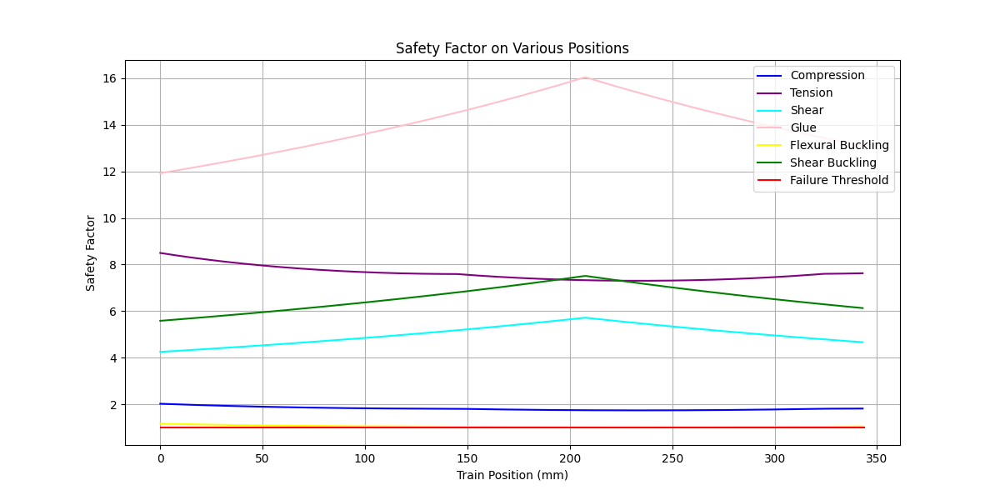

# CIV102-Bridge-Project

> [!NOTE]
> :tada: Our bridge is tested on 2025-11-25. A blog post is available [here](https://atatc.github.io/blog/2025/bridge).

**:bookmark_tabs: Docs are available as [Wiki](https://github.com/ATATC/CIV102-Bridge-Project/wiki).**

## Project Description

The CIV102 course has a term project where we build a bridge with a matboard that aims to survive under various load
cases. It is actually one of the requirements that we need to implement some sort of automated analysis procedure. Our
team decide to take this one step further and make these features possible:

- Composition of complex cross-sections using basic shapes
- Automatic calculation of (x̄, ȳ) (the centroid), I (the moment of inertia), and Q(y) (the first moment of area about
  a given axis)
- Visualization of cross-sections
- Automatic calculation of shear forces (pivot points) and expanded shear forces
- Shear force diagram
- Automatic calculation of bending moments (pivot points) and expanded bending moments
- Bending moment diagram
- Automatic calculation of axial and shear stresses
- Safe factor diagram
- Automatic calculation of curvatures, slopes, and displacements
- Displaced shape
- Simulation of the train passing the bridge
- Finding the maximum load
- Optimization of the cross-section dimensions
- Extendability to other types of bridges
- **Extremely easy to use**

## Overview

We did a pretty good job designing the bridge. Our predicted load was 1400 Newtons using a quadratic variation in the
height of the cross-section. We can approximate the parabolic area by trapezoids.

Before actually making the bridge, we bought 3 matboards with an identical shape from
[Michaels](https://canada.michaels.com). We did a box beam and a trapezoid as two prototypes. If you try it on your own,
you will soon realize that the biggest limitation of the project is not designing, but your paper-cutting and gluing
skills. The trapezoid wastes a small amount of board area, resulting in fewer diaphragms. Also, the cutting optimization
App we use, [optiCutter](https://www.opticutter.com), only supports rectangular panels. It is so hard to manufacture
that we decided to stick with the box beam, which still has a predicted maximum load of 1200 Newtons.

## Installation

```shell
pip install git+https://github.com/ATATC/CIV102-Bridge-Project.git
```

## Quick Start

All dimensions are measured in millimeters. All loads are measured in Newtons. All angles are measured in radians. All
complex units are combinations of these fundamental units.

### Deliverable 1 as an Example

It is quite obvious that you need to have a bridge before analyzing it. To create a `BeamBridge`, you need to know the
following parameters. The checked ones are defaulted to what we are given this year as the base case in load case 2.

- [ ] Total train load in Newtons
- [ ] Cross-section profile
- [x] Length of the bridge (1200mm)
- [x] Wheel positions ([172 348 512 688 852 1028], which is the center)
- [x] Load distribution (1.35 1.35 1 1 1 1)

The following case uses the default cross-section.

```python
from bridger import *

cross_section = CIV102Beam()
material = Material()
bridge = BeamBridge(452, cross_section)
bridge.plot_sfd(save_as="assets/images/sfd.png")
bridge.plot_bmd(save_as="assets/images/bmd.png")
print(f"(x_bar, y_bar): {cross_section.centroid()} mm")
print(f"I_x: {cross_section.moment_of_inertia()} mm4")
print(f"Ultimate applied stress: {bridge.ultimate_stress()} MPa")
print(f"FOS: {bridge.safety_factor((material.compressive_strength, material.tensile_strength))}")
```

You will see output like this:

<table>
<tr>
<td></td>
<td></td>
</tr>
</table>

```text
(x_bar, y_bar): (49.99999999999999, 41.43109435192319) mm
I_x: 418352.20899942354 mm4
Ultimate applied stress: (6.384059301633374, 7.592045684386937) MPa
FOS: (0.9398408937813106, 3.9515041462006852)
```

### Plot the Displaced Shape

Furthermore, we can plot the displaced shape.

```python
from bridger import *

cross_section = CIV102Beam()
material = Material()
bridge = BeamBridge(452, cross_section)
bridge.plot_displaced_shape(material, save_as="assets/images/displaced_shape.png")
```



### Predict the Maximum Load

```python
from bridger import *

cross_section = CIV102Beam()
material = Material()
bridge = BeamBridge(452, cross_section)
evaluator = Evaluator(bridge, material)
print(evaluator.maximum_load())  # (240.0889550207032, 'flexural buckling')
```

### Plot the Factors of Safety at the Maximum Load

```python
from bridger import *

cross_section = CIV102Beam()
material = Material()
bridge = BeamBridge(452, cross_section)
evaluator = Evaluator(bridge, material)
bridge.train_load(train_load=evaluator.maximum_load()[0])
evaluator.plot_safety_factors(save_as="assets/images/safety_factors_d1.png")
```



## Team 602

### Authors

Sorting follows alphabetic order of the first name initials and does not reflect contributions. The hyperlinks refer to
portfolios.

D. Chan, J. Zhou, N. Saxena, and [T. Fu](https://atatc.github.io)

### Citation

```bibtex
@techreport{team602civ102,
    title = {CIV102 Bridge Project Design Report},
    author = {Chan, D. and Zhou, J. and Saxena, N. and Fu, T.},
    institution = {Faculty of Applied Science and Engineering, University of Toronto},
    year = {2025},
    month = {November},
    type = {Course Project Report},
    course = {CIV102: Structures and Materials},
    note = {Team 602}
}
```
